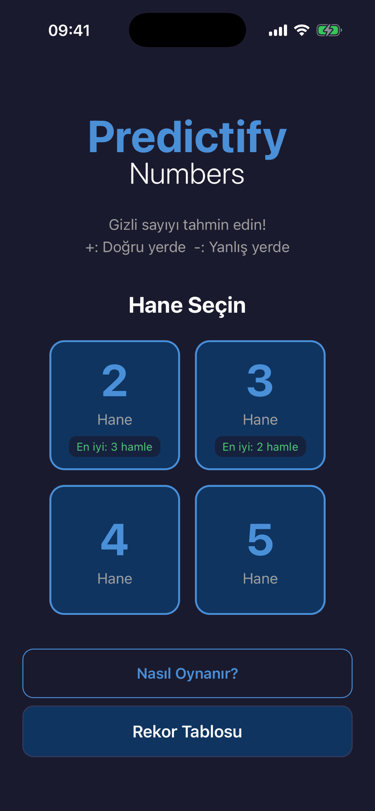
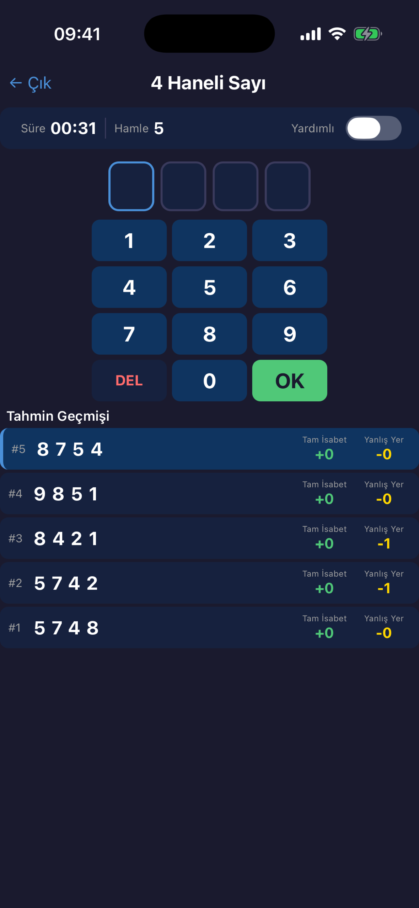
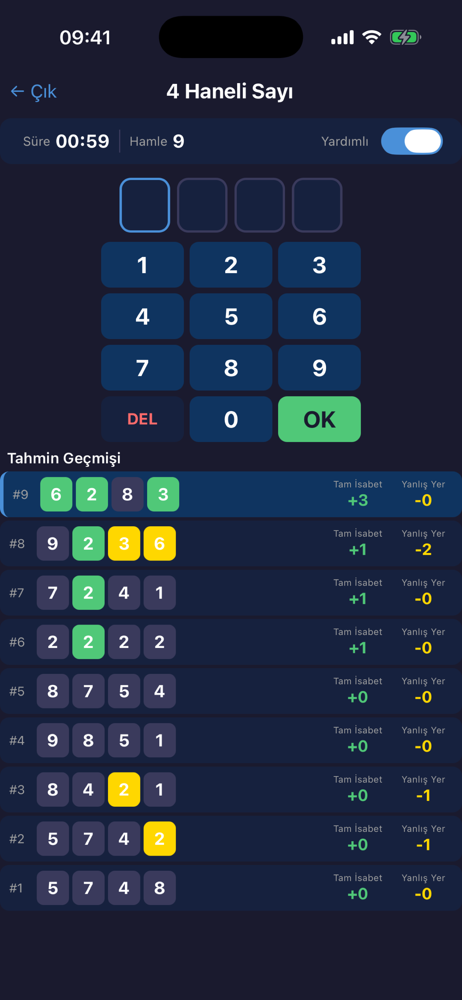

# Predictify Numbers

[](https://apps.apple.com/app/predictify-numbers/id6742519498)
[](https://expo.dev)
[](https://www.typescriptlang.org)
[](https://firebase.google.com)
[](LICENSE)

A real-time multiplayer number guessing game for iOS, built with React Native. Players try to crack a secret number using **Bulls & Cows** logic — with both single-player and online PvP modes.

<p align="center">
  
  
  
</p>

## Features

### Single Player
- **4 difficulty levels** — 2, 3, 4, and 5 digit modes
- **Assisted mode** — color-coded digit feedback (bull / cow / miss / repeat)
- **Persistent leaderboard** — top 10 records per difficulty, stored locally
- **Real-time timer** and move counter

### Online Multiplayer
- **Real-time PvP** — find and play against a random opponent
- **Coin flip** — both players pick a digit, closest to system digit goes first
- **Turn-based gameplay** — 30-second turn timer with auto-skip
- **Assisted / unassisted modes** — players are matched by mode preference
- **Win streak tracker** — consecutive wins displayed on home screen with 🔥
- **Forfeit & disconnect handling** — quit button with confirmation, 30s disconnect timeout

### UI / UX
- **Dark theme** throughout
- **Haptic feedback** on every interaction
- **Animations** — shake on invalid input, pulsing search indicator, flashing timer
- **Turkish UI** — fully localized

## Tech Stack

| Layer | Technology |
|-------|-----------|
| Framework | React Native 0.81 + Expo SDK 54 |
| Language | TypeScript 5.9 |
| Navigation | React Navigation (native-stack) |
| State | `useReducer` + Context (offline), custom hooks (online) |
| Backend | Firebase Realtime Database |
| Storage | AsyncStorage (records, win streak, player identity) |
| Build | EAS Build + EAS Submit |

## Architecture

```
src/
├── screens/
│   ├── HomeScreen.tsx          # Mode selection (solo / online)
│   ├── GameScreen.tsx          # Single-player game
│   ├── OnlineLobbyScreen.tsx   # Matchmaking + mode toggle
│   ├── OnlineGameScreen.tsx    # Online PvP game
│   └── RecordsScreen.tsx       # Leaderboard
├── components/
│   ├── GuessInput.tsx          # Custom numpad
│   ├── GuessHistory.tsx        # Guess list with assisted mode colors
│   ├── DigitSelector.tsx       # Difficulty picker
│   ├── CoinFlipView.tsx        # Coin flip UI
│   ├── OnlineInfoBar.tsx       # Turn indicator + timer + quit
│   ├── OnlineResultModal.tsx   # Win/lose/forfeit/disconnect modal
│   └── DisconnectBanner.tsx    # Opponent disconnect warning
├── hooks/
│   ├── useMatchmaking.ts       # Queue join/leave/poll state machine
│   └── useOnlineGame.ts        # Game listener, heartbeat, turn timer
├── services/
│   ├── firebase.ts             # Firebase init
│   ├── matchmaking.ts          # Atomic queue matching (transactions)
│   ├── onlineGame.ts           # Guess submit, coin flip, forfeit, skip
│   └── playerIdentity.ts       # Anonymous UUID via AsyncStorage
├── utils/
│   ├── gameLogic.ts            # Number generation, guess evaluation
│   ├── coinFlip.ts             # First-turn computation
│   └── storage.ts              # Records + win streak persistence
├── context/
│   └── GameContext.tsx          # Offline game state (useReducer)
├── types/
│   ├── index.ts                # Core types + navigation params
│   └── online.ts               # Online multiplayer types
└── constants/
    └── theme.ts                # Colors, spacing, border radius
```

## Online Multiplayer Flow

```
HomeScreen → OnlineLobby → Matchmaking Queue
                               ↓
                          Coin Flip (both pick 0-9)
                               ↓
                      Turn-based Guessing (6 digits)
                               ↓
                    Win (6 bulls) / Forfeit / Disconnect
```

**Race condition prevention:** Matchmaking uses a Firebase transaction on the entire queue node to atomically claim both entries. Coin flip resolution also uses a transaction to prevent conflicting `firstTurn` writes when picks are equidistant.

## Getting Started

```bash
git clone https://github.com/alperyardimci/predictify-numbers.git
cd predictify-numbers
npm install
npx expo start
```

## License

MIT — see [LICENSE](LICENSE) for details.

## Author

**Alper Yardimci** — [GitHub](https://github.com/alperyardimci)
